# Calendar Booking System Documentation

## Overview

The calendar booking system allows mentees to book sessions with mentors based
on available time slots. The system handles timezone conversions, schedule
exclusions, and session duration management.

## Key Concepts

### 4.1 Future Dates Only

Events can only be created for future dates. The system enforces this through
validation rules:

- `fromDate` must be today or a future date
- `toDate` must be on or after `fromDate`
- The maximum booking window is defined by
  `CalendarEvent::MAXIMUM_NUMBER_OF_MONTHS_EVENT_CAN_BE_SET` (6 months)

### 4.2 MentorProgram Connection

Every calendar event associated with mentor sessions requires a valid
`mentor_program_id`:

- The `mentor_program_id` links the event to a specific mentorship program
- **Restriction**: Mentors cannot create events for their own mentor programs.
  These events are created by mentees when they book a slot.
- Only the mentor who owns the program can confirm or update existing events
  associated with it.
- Events without a `mentor_program_id` are treated as personal calendar events.

### 4.3 Event Status Flow

Calendar events follow a specific status workflow:

```
PENDING_MENTOR_CONFIRMATION -> CONFIRMED -> FINISHED
                           \-> CANCELLED
```

**Status Definitions:**

| Status                        | Description                                                           |
| ----------------------------- | --------------------------------------------------------------------- |
| `PENDING_MENTOR_CONFIRMATION` | Event created by mentee, awaiting mentor confirmation                 |
| `PENDING_PAYMENT`             | Event confirmed but payment pending (for future logic implementation) |
| `CONFIRMED`                   | Event confirmed by all parties                                        |
| `FINISHED`                    | Event has been completed                                              |
| `CANCELLED`                   | Event was cancelled                                                   |

**Status Transitions:**

1. When a mentee books a slot, the initial status depends on the mentor program
   settings:
   - If "requires confirmation" is enabled: Status is
     `PENDING_MENTOR_CONFIRMATION`
   - If "requires confirmation" is disabled: Status is `CONFIRMED` (until
     payment logic is implemented)
2. When a mentor manually confirms a pending event, status changes to
   `CONFIRMED`
3. A `MentorSession` is automatically created whenever an event reaches
   `CONFIRMED` status (either upon creation or via status change)
4. Completed events are marked as `FINISHED`
5. Either party can cancel, changing status to `CANCELLED`, but **only if the
   event is not yet CONFIRMED**.
   - _Future plan_: Implement logic to propose postponing or handle refunds for
     confirmed events.

**Restrictions:**

- `FINISHED` events cannot be edited or deleted
- `CANCELLED` events cannot be edited but can be deleted
- Only `CONFIRMED` and `PENDING_MENTOR_CONFIRMATION` events can be modified
- **Cancellation**: Events can only be cancelled while in
  `PENDING_MENTOR_CONFIRMATION` status. Confirmed events cannot be cancelled
  directly.

### 4.4 Session Duration

Each mentor program has a configurable `session_duration` setting (in minutes):

- **Default Value**: The system defaults to **60 minutes** if no value is
  specified.
- **Enum Constraint**: The `session_duration` must be one of the values defined
  in `MentorSessionDurationOptionsEnum` (e.g., 15, 30, 45, 60, 90, 120 minutes).
- Available slots are automatically split based on this duration.
- The `SplitSlotsPerSessionDuration` service handles slot splitting.

**How it works:**

1. Available time blocks are calculated from mentor's schedule.
2. Existing events are excluded from available time.
3. Remaining time is split into slots matching the program's `session_duration`.

### 4.5 Minimum Pre-booking Time

The `minimum_pre_booking_time` setting controls how far in advance bookings can
be made.

- **Level of Configuration**: This is set on the **mentor's profile**, not per
  each individual mentor program.
- **Unit**: Stored in **minutes**. (It is not stored in seconds or "seconds as
  minutes").
- **Default**: 0 (no minimum).
- **Example**: Setting to 1440 (24 hours) means mentees must book at least 1 day
  in advance.

## Core Services

### BookingCalendarEventsService

Main service for generating available booking slots:

```php
$service = new BookingCalendarEventsService(
    $selectedDate,      // Carbon date to display
    $mentor,            // User model (mentor)
    $timezone,          // Client timezone
    $excludeSchedule,   // Whether to apply mentor's schedule
    $mentorProgram      // MentorProgram model
);

$result = $service->getFormattedMonthAvailableSlots();
// Returns: ['calendarSlots' => [...], 'hasEventsBefore' => bool, 'hasEventsAfter' => bool]
```

### AvailableCalendarEventsSlotsService

Calculates raw available time slots:

- Excludes time occupied by existing events
- Handles multi-day events
- Respects timezone conversions

### ExcludeUserScheduleSchemeService

Filters available slots based on mentor's working schedule:

- Supports multiple working periods per day
- Handles day-off dates
- Performs timezone conversions for schedule matching

### SplitSlotsPerSessionDuration

Splits available time blocks into bookable slots:

- Groups slots by date
- Handles slots spanning midnight
- Respects session duration from mentor program

## CalendarEventObserver

Automatically creates `MentorSession` records when events are confirmed:

**Triggers when:**

- Event status changes TO `CONFIRMED`
- Event is created directly with `CONFIRMED` status (if mentor program does not
  require confirmation)
- Event has a valid `mentor_program_id`
- Event has both HOST and PARTICIPANT users attached

**Creates MentorSession with:**

- `mentor_id`: From user with HOST role
- `menti_id`: From user with PARTICIPANT role
- `date`: From event's `start_date_time`
- `mentor_program_id`: From event's `mentor_program_id`

## Timezone Handling

The system stores all times in UTC and converts for display:

1. Events are stored with UTC timestamps in `start_date_time` and
   `end_date_time`
2. User's timezone preference is stored in their profile
3. Available slots are calculated and returned in the requested timezone
4. Schedule times are stored as local times and converted when checking
   availability

## Concurrent Booking Prevention

The system prevents double-booking and resolves slot conflicts:

1. **Validation**: When confirming an event, the system checks for existing
   overlapping `CONFIRMED` events.
2. **Conflict Resolution**: When a mentor confirms a specific event, all other
   `PENDING_MENTOR_CONFIRMATION` events that overlap with this time slot are
   **automatically cancelled**.
   - This applies to all events hosted by the same mentor, across **all of their
     mentor programs**.
3. **Overlaps**:
   - Partial overlaps are blocked (event A: 14:00-15:00, event B: 14:30-15:30)
   - Adjacent slots are allowed (event A ends at 15:00, event B starts at 15:00)
   - Events completely inside another are blocked

## Booking Constraints

1. **Exact Slots Only**: Mentees can only book events within the specific time
   slots provided by the `BookingCalendarEventsService`.
2. **Validation**: The `CheckBookingSlotService` ensures that the requested
   `start_date_time` and `end_date_time` exactly match a valid available slot
   calculated from the mentor's schedule and the program's `session_duration`.

## Database Schema

### calendar_events

| Column            | Type      | Description                      |
| ----------------- | --------- | -------------------------------- |
| id                | bigint    | Primary key                      |
| title             | string    | Event title                      |
| status            | string    | Event status (enum)              |
| start_date_time   | datetime  | Start time (UTC)                 |
| end_date_time     | datetime  | End time (UTC)                   |
| date              | date      | Event date                       |
| type              | string    | Event type (individual, group)   |
| session_type      | string    | Meeting type (online, offline)   |
| web_link          | string    | Meeting link (optional)          |
| description       | text      | Event description (optional)     |
| mentor_program_id | bigint    | FK to mentor_programs (nullable) |
| mentor_session_id | bigint    | FK to mentor_sessions (nullable) |
| created_at        | timestamp | —                                |
| updated_at        | timestamp | —                                |

### calendar_event_user (pivot)

| Column            | Type      | Description                           |
| ----------------- | --------- | ------------------------------------- |
| id                | bigint    | Primary key                           |
| calendar_event_id | bigint    | FK to calendar_events                 |
| user_id           | bigint    | FK to users                           |
| role              | string    | User's role (Host, Participant, etc.) |
| colour            | string    | Display colour                        |
| confirmed_at      | datetime  | When user confirmed                   |
| created_at        | timestamp | —                                     |
| updated_at        | timestamp | —                                     |

### user_schedules

| Column       | Type      | Description               |
| ------------ | --------- | ------------------------- |
| id           | bigint    | Primary key               |
| user_id      | bigint    | FK to users               |
| day_of_week  | int       | 1-7 (Monday-Sunday)       |
| start_time   | time      | Working hours start       |
| end_time     | time      | Working hours end         |
| type         | string    | WORKING_DAY or DAY_OFF    |
| day_off_date | date      | Specific date for day off |
| created_at   | timestamp | —                         |
| updated_at   | timestamp | —                         |

### mentor_programs

| Column               | Type      | Description                         |
| -------------------- | --------- | ----------------------------------- |
| id                   | bigint    | Primary key                         |
| mentor_id            | bigint    | FK to users                         |
| name                 | string    | Program name                        |
| slug                 | text      | SEO slug                            |
| is_main              | boolean   | Whether it's the main program       |
| description          | text      | Program description                 |
| cost                 | decimal   | Program cost                        |
| currency_id          | bigint    | FK to currencies                    |
| start_time           | datetime  | Start of program period (optional)  |
| end_time             | datetime  | End of program period (optional)    |
| session_duration     | integer   | Duration in minutes (default 60)    |
| session_type_options | json      | Available meeting types             |
| need_confirmation    | boolean   | Whether mentor must confirm booking |
| created_at           | timestamp | —                                   |
| updated_at           | timestamp | —                                   |

### user_profiles

| Column                   | Type      | Description                        |
| ------------------------ | --------- | ---------------------------------- |
| id                       | bigint    | Primary key                        |
| user_id                  | bigint    | FK to users                        |
| name                     | string    | First name                         |
| last_name                | string    | Last name                          |
| timezone                 | string    | User's timezone (e.g. UTC)         |
| minimum_pre_booking_time | integer   | Minutes before booking (default 0) |
| created_at               | timestamp | —                                  |
| updated_at               | timestamp | —                                  |

## External Calendar Integrations

The application supports syncing events to Google Calendar, Microsoft Outlook,
and Apple Calendar. Each provider requires a separate one-time setup by a
developer before users can connect their accounts.

---

### Credential Encryption

All OAuth tokens and user-supplied credentials are encrypted at rest using
AES-256. Generate a key and add it to `.env` before any provider is used:

```bash
php -r "echo base64_encode(random_bytes(32));"
```

```env
CALENDAR_ENCRYPTION_KEY1=<generated-key>
CALENDAR_ENCRYPTION_KEY_PREVIOUS=   # leave empty on first setup
```

`KEY1` encrypts new data. `CALENDAR_ENCRYPTION_KEY_PREVIOUS` is only used when
rotating keys — populate it with the old `KEY1` value during rotation, then
re-encrypt all stored credentials before clearing it.

---

### OAuth Authentication Flow (Google / Outlook)

The following describes what happens end-to-end when a user connects an external
calendar account.

#### Phase 1 — User initiates connection

1. User opens **Settings → External Calendars** and clicks **Connect**.
2. `ExternalCalendarConnectRedirect` fires. If the provider requires per-user
   credentials, `client_id` and `client_secret` are read from the form.
3. `saveCredentials()` creates a `UserCalendarIntegration` row and persists the
   credentials encrypted at rest via `CalendarCredentialEncrypter` (see
   [Credential Encryption](#credential-encryption)).
4. An OAuth `state` token is built — Laravel's own `encrypt()` wraps a JSON
   payload of `{user_id, provider}` to prevent CSRF.
5. The user's session also stores `calendar_oauth_pending` as a fallback for
   providers that do not return `state` in the callback.
6. The browser is redirected to the provider's OAuth consent screen via
   `Inertia::location($oauthUrl)`.

#### Phase 2 — Provider callback

7. After the user grants permission the provider redirects back to
   `/settings/external-calendar/callback/{provider}?code=xxx&state=yyy`.
8. `ExternalCalendarConnectCallback` resolves the `state` parameter back to a
   `User` + `CalendarProviderEnum` (falls back to session if `state` is absent).
9. The `code` is exchanged for tokens via a server-side POST to the provider's
   token endpoint. The response contains `access_token`, `refresh_token`, and
   `expires_in`.
10. Tokens are written back to the `UserCalendarIntegration` row. The
    `EncryptedCalendarCredential` cast encrypts each value transparently before
    it reaches the database:

```
plaintext token
  → random IV (12 bytes)
  → AES-256-GCM encrypt  →  ciphertext + authentication tag
  → base64(iv):base64(tag):base64(ciphertext)
  → stored in TEXT column
```

#### Phase 3 — Ongoing API usage

11. Every subsequent API call (fetch calendars, create/update/delete events)
    reads the token column. The cast decrypts transparently:

```
base64(iv):base64(tag):base64(ciphertext)
  → split on ':'
  → openssl_decrypt with stored iv + tag  →  plaintext token
  → Authorization: Bearer <token>
```

12. If the `access_token` is expired, `refreshTokenIfExpired()` uses the
    decrypted `refresh_token` to obtain a new one from the provider and
    re-encrypts it back to the database.

#### What is stored where

| Data                                          | Location                                          | Encrypted         |
| --------------------------------------------- | ------------------------------------------------- | ----------------- |
| `access_token`                                | `user_calendar_integrations.access_token` (TEXT)  | Yes — AES-256-GCM |
| `refresh_token`                               | `user_calendar_integrations.refresh_token` (TEXT) | Yes — AES-256-GCM |
| `client_id` / `client_secret` (per-user flow) | same table                                        | Yes — AES-256-GCM |
| Encryption key                                | `.env` / server environment only                  | — never in DB     |

---

### Google Calendar

The application supports two Google flows that cannot be active simultaneously:

| Flow                                       | Provider enum                               | When to use                                                |
| ------------------------------------------ | ------------------------------------------- | ---------------------------------------------------------- |
| **App-level OAuth** (`google`)             | `CalendarProviderEnum::GOOGLE`              | You register one OAuth app; all users authenticate via it  |
| **Per-user OAuth** (`google_personal_app`) | `CalendarProviderEnum::GOOGLE_PERSONAL_APP` | Each user supplies their own `client_id` / `client_secret` |

#### Setting up the app-level flow (recommended)

1. Go to [Google Cloud Console](https://console.cloud.google.com/) and create or
   select a project.

   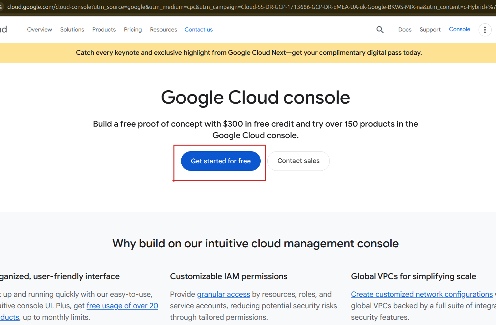

2. Enable the **Google Calendar API**:
   - Navigate to **APIs & Services → Library**
   - Search for "Google Calendar API" and click **Enable**

   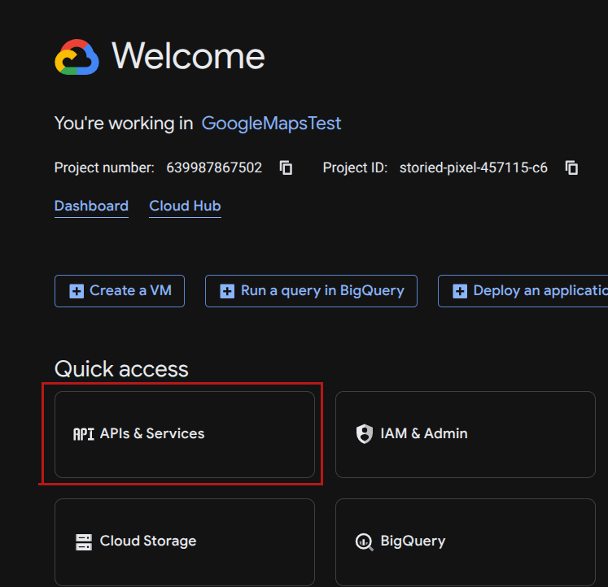

   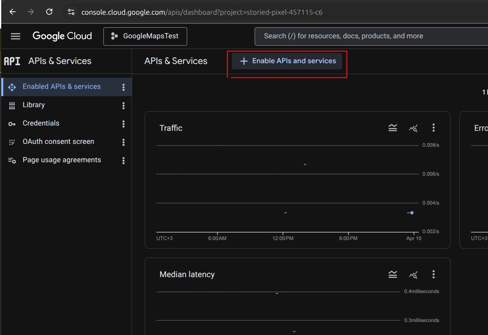

3. Configure the OAuth consent screen:
   - Go to **APIs & Services → OAuth consent screen**
   - Select **External** (to allow any Google account to connect)
   - Fill in the application name, support email, and developer contact
   - Add the scope `https://www.googleapis.com/auth/calendar`
   - Add your domain to **Authorized domains**
   - Submit for verification if you plan to allow more than 100 test users

   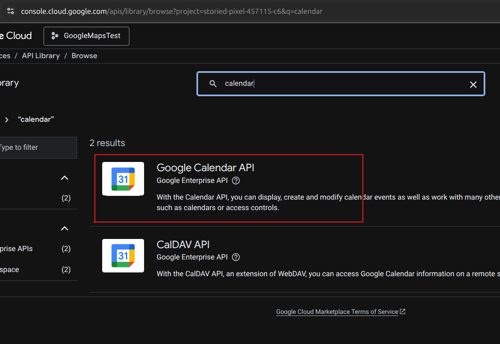

   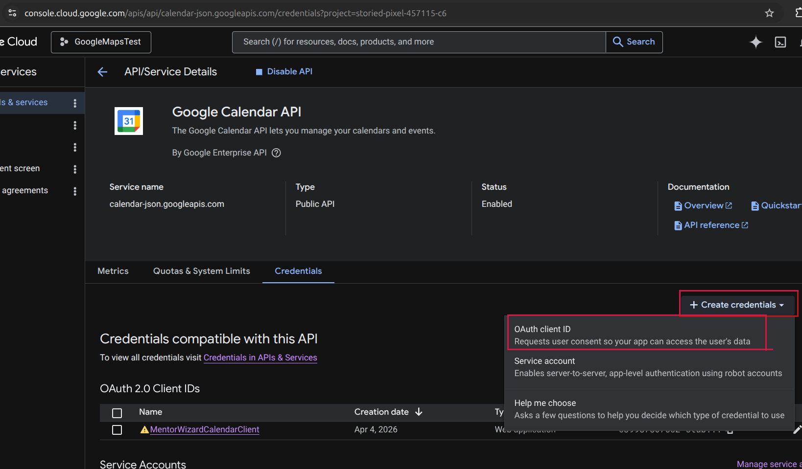

4. Create OAuth 2.0 credentials:
   - Go to **APIs & Services → Credentials → Create Credentials → OAuth client
     ID**
   - Application type: **Web application**
   - Add an **Authorized redirect URI**:
     ```
     https://your-domain.com/settings/external-calendar/callback/google
     ```
   - Copy the **Client ID** and **Client Secret**

   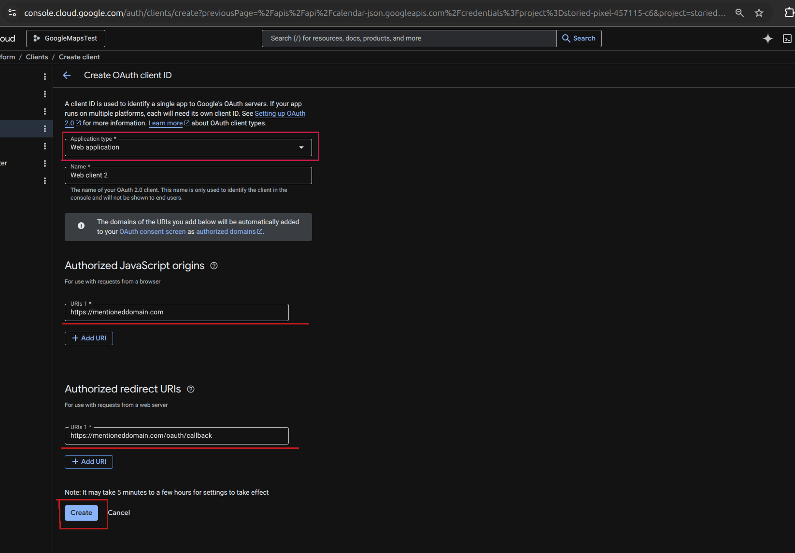

   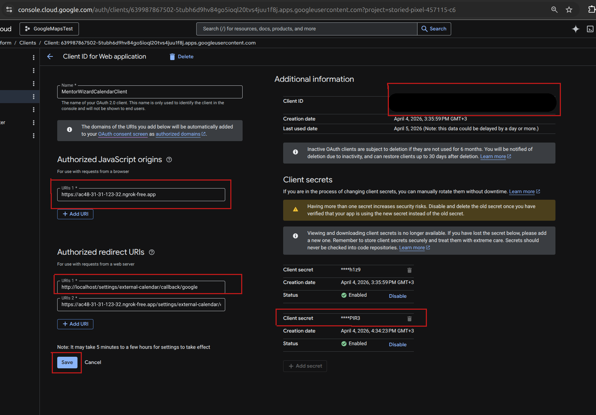

5. Add to `.env`:

   ```env
   GOOGLE_CALENDAR_CLIENT_ID=<client-id>
   GOOGLE_CALENDAR_CLIENT_SECRET=<client-secret>
   ```

   Leave these empty to fall back to the per-user flow where users enter their
   own credentials.

#### Per-user flow

No developer credentials required. Users navigate to **Settings → External
Calendars**, enter their own Google OAuth `client_id` and `client_secret`, and
authorize access. They must create their own Google Cloud project and enable the
Calendar API themselves.

---

### Microsoft Outlook Calendar

Outlook integration uses a **multi-tenant Azure AD app**. You register one app
in Azure; users from any Microsoft account (personal, work, school) can then
connect without any per-user configuration.

#### 1. Create an Azure account and subscription

Go to [portal.azure.com](https://portal.azure.com) and sign in or create a free
account. A free tier is sufficient for development.

#### 2. Register an application in Azure AD

1. In the Azure portal search bar type **App registrations** and open it.
2. Click **New registration**.
3. Fill in:
   - **Name**: e.g. `MentorWizard Calendar`
   - **Supported account types**: select  
     **Accounts in any organizational directory (Any Microsoft Entra ID tenant –
     Multitenant) and personal Microsoft accounts (e.g. Skype, Xbox)**  
     This allows both work/school Entra ID accounts and personal Outlook/Hotmail
     accounts.
   - **Redirect URI**: leave empty for now — you will add it in the next step.
4. Click **Register**.
5. Copy the **Application (client) ID** — this is `MICROSOFT_CLIENT_ID`.

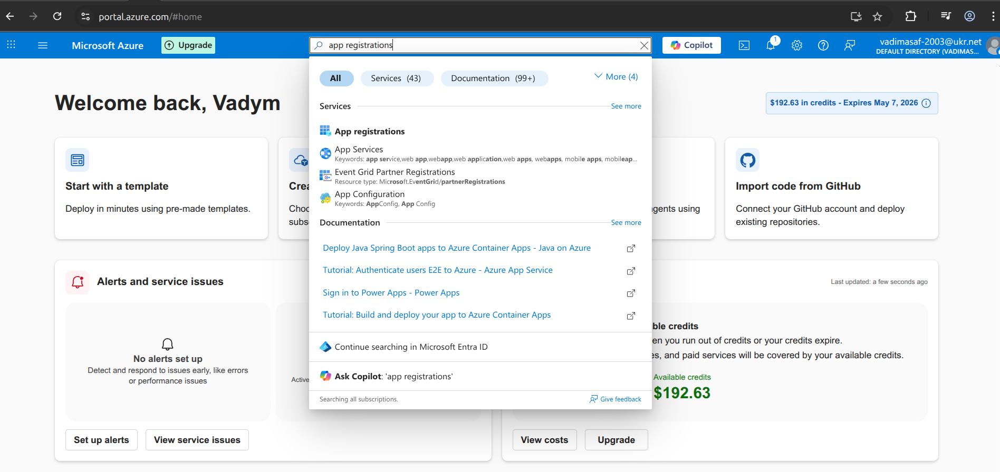

#### 3. Set the MPN ID (Branding & properties)

1. In the left sidebar click **Branding & properties**.
2. Find the **Publisher domain** and **MPN ID** fields.
3. Enter your **Microsoft Partner Network (MPN) ID** in the MPN ID field. This
   is required for the app to be shown as a verified publisher to users during
   the OAuth consent screen — without it the consent dialog will display an
   "unverified" warning.
4. Click **Save**.

> If you don't have an MPN ID yet, enroll at
> [partner.microsoft.com](https://partner.microsoft.com). A free membership tier
> is sufficient.

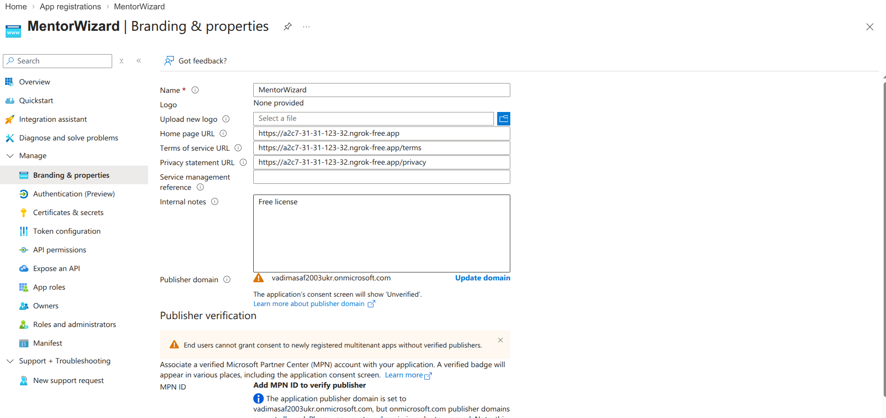

#### 4. Configure the redirect URI (Authentication tab)

After registration you are taken to the app overview page.

1. In the left sidebar click **Authentication**.
2. Under **Platform configurations** click **Add a platform** and choose
   **Web**.
3. Enter the redirect URI:
   ```
   https://your-domain.com/settings/external-calendar/callback/outlook
   ```
4. Click **Configure**, then **Save**.

> You can add additional redirect URIs here later (e.g. a localhost URI for
> local development:
> `http://localhost:8080/settings/external-calendar/callback/outlook`).

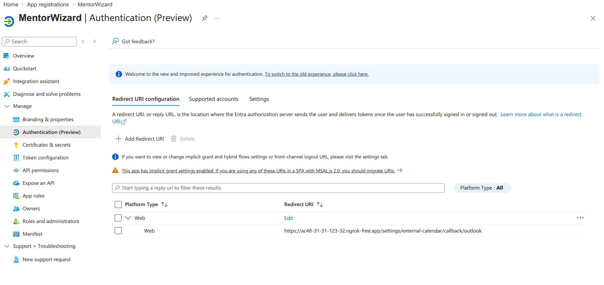

#### 5. Create a client secret

1. Inside the app registration, go to **Certificates & secrets → New client
   secret**.
2. Set a description and expiry (choose 24 months for convenience).
3. Copy the **Value** immediately — it is only shown once. This is
   `MICROSOFT_CLIENT_SECRET`.

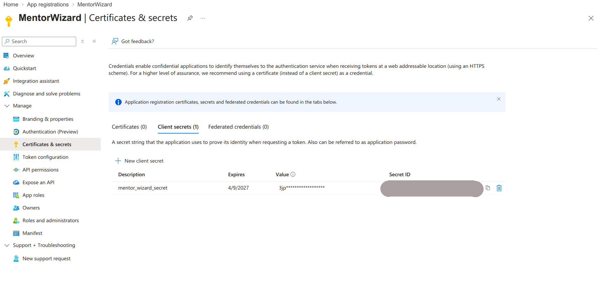

#### 6. Add API permissions

1. Go to **API permissions → Add a permission → Microsoft Graph**.
2. Select **Delegated permissions** and add:
   - `Calendars.Read`
   - `Calendars.ReadBasic.All`
   - `Calendars.ReadWrite`
   - `offline_access` (required for refresh tokens)
   - `User.Read`
3. Click **Grant admin consent for [your tenant]** (if you have admin rights).
   If not, users will be prompted to consent on first login.

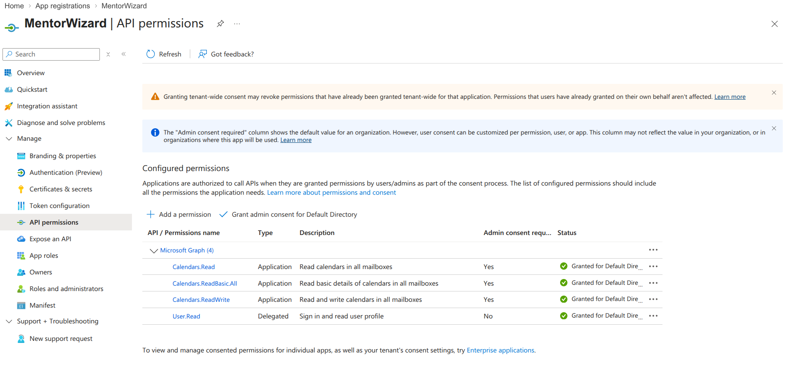

#### 7. Add to `.env`

```env
MICROSOFT_CLIENT_ID=<application-client-id>
MICROSOFT_CLIENT_SECRET=<client-secret-value>
```

> **No API Management Service is needed.** Azure API Management is an enterprise
> gateway product for publishing your own APIs. The Outlook integration calls
> Microsoft Graph directly; no APIM instance is required. Similarly, deploying
> the Laravel application to Azure App Service is optional — the integration
> works from any host as long as the redirect URI is reachable from the
> internet.

---

### Apple Calendar (CalDAV)

Apple Calendar uses the **CalDAV** protocol. There is no OAuth flow and no app
registration required on the developer side — the integration is entirely
user-arranged.

**What the user must do:**

1. Sign in to [appleid.apple.com](https://appleid.apple.com).

   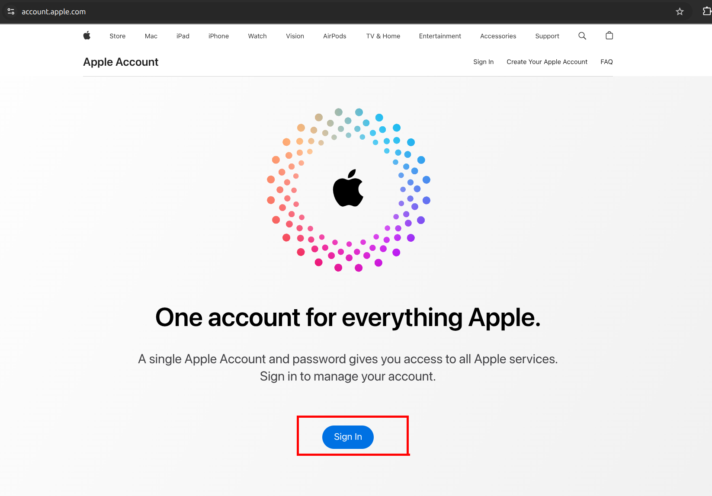

2. Under **Sign-In and Security → App-Specific Passwords**, generate an
   app-specific password. This is required because Apple does not allow
   third-party apps to use the main Apple ID password.

   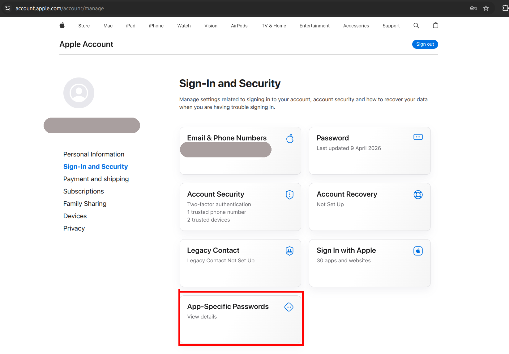

   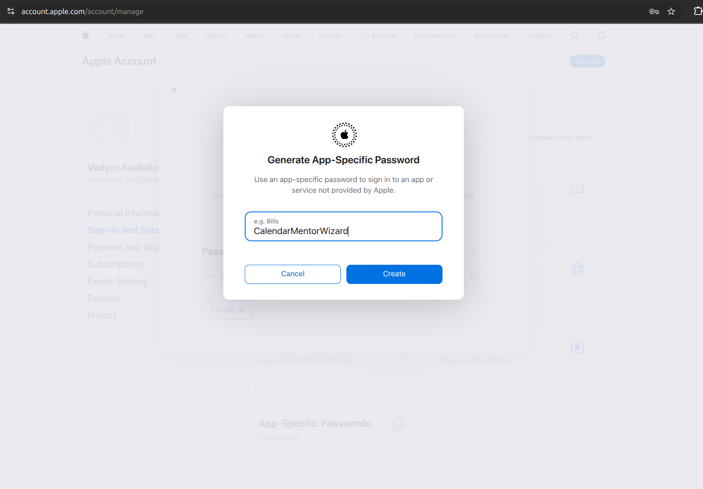

3. In the application under **Settings → External Calendars**, select Apple
   Calendar and enter:
   - **Email / username**: their Apple ID email address
   - **Password**: the app-specific password generated above

   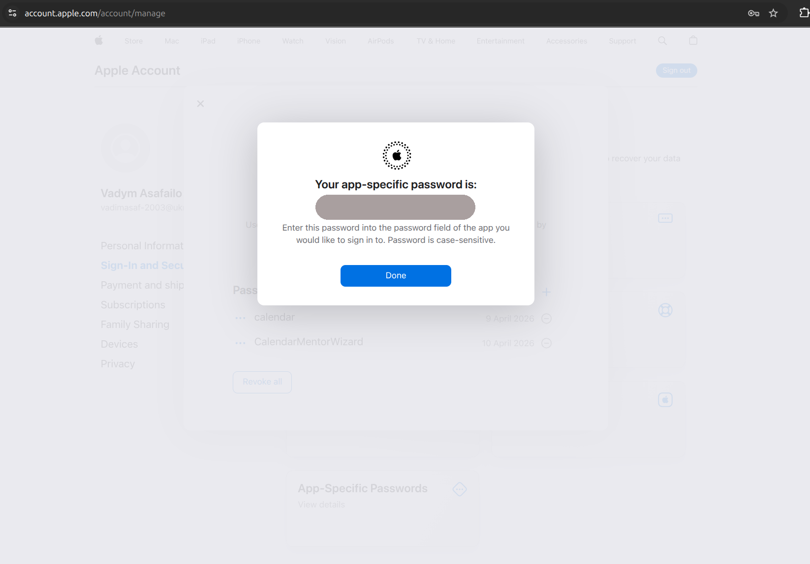

4. The CalDAV server URL used internally is `https://caldav.icloud.com` — this
   is hardcoded in the service and does not need to be configured.

**Developer note:** No environment variables are required for Apple Calendar.
The `AppleCalDavExternalCalendarService` authenticates directly with
`caldav.icloud.com` using the user-supplied credentials, which are encrypted and
stored via `CalendarCredentialEncrypter`.

---

### Environment variable summary

```env
# Encryption (required for all providers)
CALENDAR_ENCRYPTION_KEY1=           # base64(random_bytes(32))
CALENDAR_ENCRYPTION_KEY_PREVIOUS=   # previous KEY1 value during rotation only

# Google — app-level flow (leave empty to use per-user flow)
GOOGLE_CALENDAR_CLIENT_ID=
GOOGLE_CALENDAR_CLIENT_SECRET=

# Microsoft Outlook — multi-tenant Azure AD app
MICROSOFT_CLIENT_ID=
MICROSOFT_CLIENT_SECRET=
```

---

## Testing

Run calendar-related tests:

```bash
# Run all calendar tests
php artisan test --filter=Calendar

# Run specific service tests
php artisan test tests/Unit/Services/Calendar/

# Run mutation tests
./vendor/bin/pest --mutate --class=BookingCalendarEventsService
./vendor/bin/pest --mutate --class=CalendarEventObserver
```
